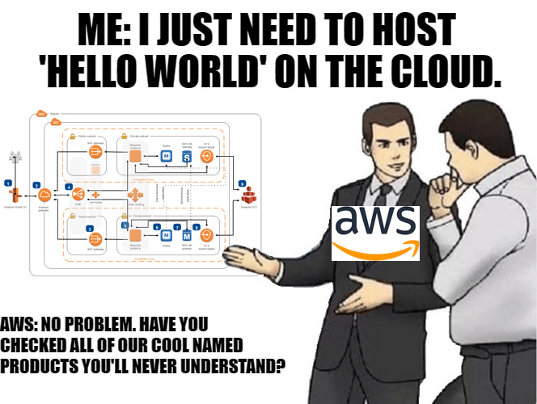
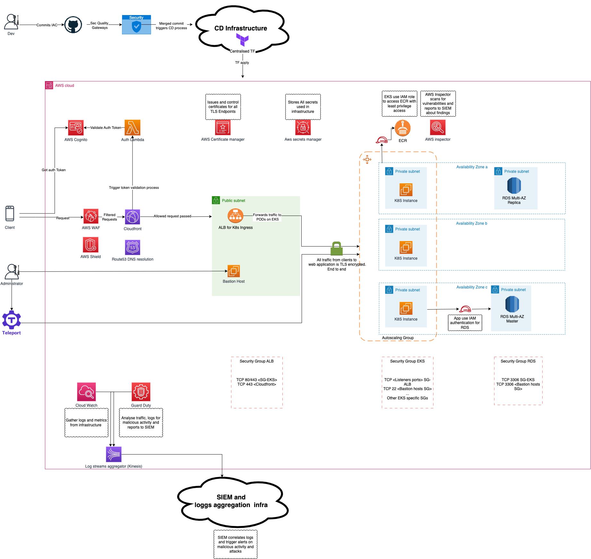
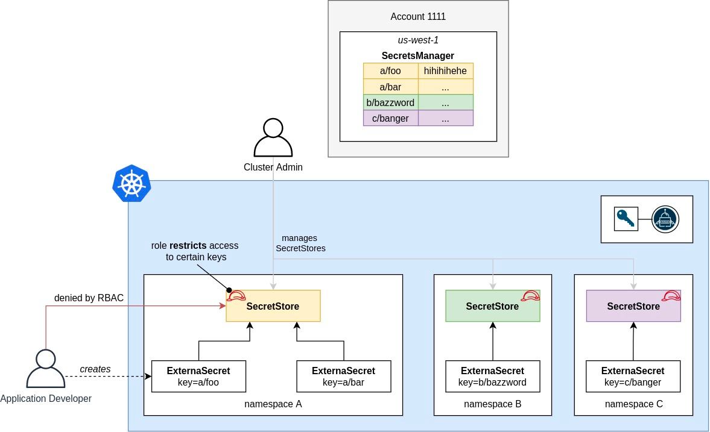

## Problems

### Potential attack vectors
- **Unauthorized Access**: Open security group rules could allow attackers to gain access to instances.
- **SQL Injection**: Vulnerable web applications could be prone to SQL injection attacks.
- **Denial of Service (DoS)**: Exploited open ports might lead to DoS attacks.
- **Man-in-the-Middle (MitM)**: Lack of encryption could enable data interception.
- **Container Vulnerabilities and Malware**: Supply chain attacks may lead to malicious runtime activity.
- **Compromised Insider**: An employee with malicious intent or compromised credentials poses a threat.

### IaC approach
Managing Terraform configuration requires saving the state in a secure place. Applying configuration from a laptop indicates no continuous deployment in use and direct access to the production environment, leading to:
- Misconfigurations.
- Accidental infrastructure changes.
- Increased compromise risk if a developer's account is compromised.
- Sensitive data leakage.

### Web app and API security
- Web applications exposed via load balancers are vulnerable to logical errors or exploits, like SQL injections, especially without a WAF.
- Lack of DDoS protection.

### Authentication
Storing user accounts in a web app configuration file results in:
- Scalability issues.
- Delays and errors from needing replicated configurations across pods.
- Security risks if credentials are compromised through web app vulnerabilities or targeted attacks on underlying infrastructure.

### Reliability 
Services should be categorized based on business goals and strategy, applying different high-availability techniques. Current architecture lacks:
- DRM site.
- Route53 configuration for HA.
- RDS multi-AZ configuration for resilience.
- CDN for content caching and improved user experience.
- Only one public subnet increases the blast radius if an instance is compromised.

### Encryption
- Absence of encryption, both at rest and in transit.
- No AWS ACM or other certificate management solutions, risking website availability.

### Kubernetes security
Assuming the use of EKS for Kubernetes, thus omitting master-related threats.
- **Security Group**: Vulnerabilities in Kubernetes nodes, from API level exploits to misconfigurations can be exploited via overpermissive SG. Allowing all traffic to nodes exposes them to various threats.
- **Autoscale Group**: Lack of autoscaling groups for Kubernetes nodes could lead to resource shortages during peak hours and pods stuck in waiting state.
- **Secrets**: No mention of a secret store or vault for Kubernetes secrets, risking sensitive data leakage in case of misconfiguration or exploits.

### RDS security
- RDS security group allows broad access from the public subnet, violating the least privilege principle. Port 80 is irrelevant for DB connections.

### Managing
- The architecture does not specify access management for the infrastructure, including break-glass mechanisms, jump/bastion hosts, or VPN-based access.

#### Monitoring
- Kubernetes complexity requires thorough monitoring to ensure application stability. No mention of application logging or security log monitoring (Control Plane, Audit).

## Competing solutions

While the architecture for the web application requires various services and approaches, this overview focuses solely on security aspects. Application performance monitoring and availability are omitted. DRM, backup strategy is out of scope of this document.

The initial solution is effective but necessitates the following modifications:

### Infrastructure components
- **CloudFront**: Utilized for content distribution and caching.
  - Static content is cached and made readily available to users through AWS's extensive infrastructure.
- **EKS**: A managed Kubernetes solution with autoscaling groups for all nodes.
  - Nodes in EKS are part of an autoscaling group, enabling the creation of new instances under increased load.
  - PODs are configured with affinity and Horizontal Pod Autoscaler (HPA) for scaling and load balancing.
  - Nodes are situated in private subnets, with traffic permitted only from the load balancer.
  - Management of EKS is facilitated through Teleport, eliminating the need for external network exposure.
  - Each pod is configured with a security context and least privilege capabilities, dropping all unnecessary capabilities.
- **K8S ALB Controller**: Manages AWS ALB automatically, aligned with Kubernetes ingress configuration.
- **RDS in Multi-AZ Mode**: Increases database resilience and ensures efficient data storage.
- **Route 53**: Provides reliable name resolution for the application and its endpoints.
- **CloudWatch**: Gathers audit logs from the EKS control plane and infrastructure metrics.
- **AWS Cognito**: Manages user registration and authentication
    - Additional lambda function deployed for tokens validation in users requests
  
### Security tools
- **AWS WAF**: Protects the web application and its API from external threats.
- **AWS Shield**: Offers DDoS attack protection.
- **AWS Certificate Manager**: Handles SSL/TLS certificates.
- **AWS Secrets Manager**: Hosts essential application secrets, including database connection strings.
- **Teleport Cloud**: Facilitates secure infrastructure management access.
- **K8S External Secrets Operator**: Integrates with AWS Secrets Manager to manage Kubernetes secrets.
- **AWS GuardDuty**: Detects threats and notifies of malicious activities.
- **AWS Inspector**: Performs vulnerability scanning of EC2 instances and container images.
- **SIEM**: Aggregates security logs and detects malicious activities.
- **Bastion Hosts**: Provide emergency access in case of Teleport failure.

### Other modifications

#### Network modifications
- Kubernetes nodes are placed in private subnets per AZ, enhancing fault tolerance and limiting the blast radius. The ingress load balancer is situated in a public subnet.

- Each security group is refined to permit only necessary traffic from specified sources, with Kubernetes node SGs allowing traffic solely from load balancers and bastion hosts.

#### RDS
- Switching RDS to Multi-AZ mode significantly enhances database high availability in case of AZ failures.
- Application purpose and traffic parameters are unknown, thus using read replicas is not relevant for this case.

## Selected solution
This architecture is crafted to provide a secure, scalable, and resilient environment for web applications. By incorporating AWS's managed services and security tools, the architecture achieves:

- **Enhanced security**: With multiple layers of defense-in-depth strategies, including WAF, Shield, Cognito authentication and GuardDuty the infrastructure is fortified against a variety of cyber threats.
- **High availability**: Multi-AZ deployments and autoscaling capabilities ensure the application remains available and performant, even under high load or during partial outages.
- **Scalability**: EKS with autoscaling, combined with the ALB Controller, allows the system to dynamically adjust resources to meet demand.
- **Operational efficiency**: Managed services reduce the overhead of maintenance and operational tasks, allowing teams to focus on development and innovation.
- **Compliance Readiness**: The architecture is designed to align with industry best practices and regulatory requirements, simplifying compliance processes.
- **Continuous Deployment (CD) Process**: With a centralized CD infrastructure, updates and changes are smoothly and consistently deployed, minimizing downtime and human error.
- **Centralized Terraform Management**: Centralizing Terraform scripts enhances consistency across deployments, enabling version-controlled infrastructure as code (IaC) that aligns with organizational standards.

## New architecture

## Reliability and Security
### Scalability
- **CloudFront**: By caching content at edge locations closer to users, CloudFront reduces the load on origin servers as traffic increases, and provides faster access to static resources.
- **EKS Autoscaling**: Amazon EKS automatically adjusts the number of Kubernetes nodes in the cluster. As traffic grows, the Horizontal Pod Autoscaler (HPA) increases the number of pod replicas to maintain performance. This ensures that the application can handle additional load without manual intervention.
- **AWS Cognito**: This identity management service scales to accommodate millions of users as application usage grows. It effectively manages user authentication and authorization, ensuring secure user access and seamless user experience even during significant surges in user registration and authentication requests.
- **RDS Multi-AZ**: Does not provide scalability out of the box but can be scaled vertically for greater transactional capacity. 

### Dependency considerations
As applications now has many dependencies, majority of which are managed services, only most critical are considered.

- **CloudFront**: CLoudfront supports fallback origins and origins groups which will allow serve requests from DRM site (out of scope).

- **EKS**: 
    - Worked nodes outages: Will lead to increased latency and increased pod in waiting mode due to lack of resources
    - Master outage: Will not affect requests from customers but will degrade management functions and new instances created by autoscaling will not be registered inside cluster

- **RDS Multi-AZ**: Failed RDS instances will not affect on application requests and failover will be handled transparently for web application

- **AWS Cognito**: If Cognito is down, new user authentication requests can't be processed. The application may still serve clients if it caches validation tokens and can verify them without contacting Cognito.

-- **AWS Lambda**: Critical component which should be located in single region - us-east-1 due to cloud front limitations. Outage of this component will not allow any authentication to succeed.

#### Services essential for application startup:
- **EKS Kubernetes**: Must be operational for container initialization.

- **Route53**: Essential service for names resolution. Without it, clients will use cached DNS entries until they are expired.

- **RDS database**: Needs to be active and available for data persistence.

- **AWS Cognito and Lambda**: Essential for operational user authentication.

- **ESO operator and AWS SM**: An outage of ESO (External Secrets Operator) will impact the updating of secrets within EKS (Elastic Kubernetes Service), but it won't hinder the web application's ability to access these secrets. This is because all secrets are cached at the Kubernetes level, ensuring that the web application remains unaffected by any disruptions in AWS Secrets Manager.

Example ESO architecture:

- **Other Services**: While crucial for security, they can be circumvented for basic operational functionality of the application.

### Countermeasures for various attacks

- **DDoS attacks**:
  - Worst-case impact: Overwhelmed infrastructure leading to service unavailability.
  - Countermeasures: Utilizing AWS Shield for DDoS protection, CloudFront for distributed network traffic, and Route 53 for DNS level protection.

- **Web application attacks (e.g., SQL Injection, XSS)**:
  - Worst-case impact: Data breach or compromise, service disruption, container escape.
  - Countermeasures: Implementing AWS WAF to filter malicious web traffic, adhering to secure coding practices in application development (SDLC), and managing vulnerabilities with AWS Inspector.

- **Authentication attacks (e.g., Credential Stuffing, Brute Force)**:
  - Worst-case impact: Unauthorized access to user accounts and potential data theft.
  - Countermeasures: Deploying AWS Cognito for robust authentication mechanisms, including multi-factor authentication (MFA), and advanced monitoring for suspicious login activities.

- **Insider threats**:
  - Worst-case impact: Data leakage, intentional disruption of services.
  - Countermeasures: Enforcing least privilege access through IAM, implementing zero access to production with break-glass management, conducting regular auditing of access and activities, and using a SIEM system for anomaly detection.

- **Expired certificates**:
  - Worst-case impact: Service outage and unavailability.
  - Countermeasures: Managing SSL/TLS certificates with AWS Certificate Manager, ensuring automatic renewal and monitoring.

- **Kubernetes-specific attacks**:
  - Worst-case impact: Cluster takeover, application compromise.
  - Countermeasures: Monitoring malicious activity with AWS GuardDuty, integrating with SIEM for rapid incident response, securing EKS configurations, setting network policies for pod-to-pod communication, and conducting regular container image vulnerability scans.

- **Data breach via database exploit**:
  - Worst-case impact: Sensitive data exposure, compliance violations.
  - Countermeasures: Implementing RDS encryption, enforcing strict security group rules, monitoring database activities, and utilizing private subnets.

### Used frameworks

- AWS well architected pillars
- AWs EKS best practices
- Zero Trust 