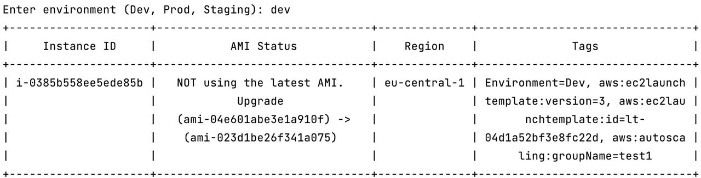

# AWS Security management script

## Introduction
This Python script provides a comprehensive tool for managing various aspects of Amazon Web Services (AWS). It enables users to list and manage EC2 instances, assess and rectify security group configurations, and suggest upgrades for AMIs. The utility is designed to simplify and automate routine AWS security management tasks.

## Prerequisites

### System Requirements
- **Python**: Ensure Python is installed on your system. This script is compatible with Python 3.x. Python can be downloaded from [python.org](https://www.python.org).

### AWS CLI Configuration
- **AWS CLI**: The script assumes that the AWS Command Line Interface (CLI) is installed and configured with at least one profile. For installation and configuration guidance, refer to [AWS CLI documentation](https://aws.amazon.com/cli/).
- **IAM Roles**: Ensure that the AWS CLI is configured with IAM roles that have sufficient permissions to perform the tasks. 

### Required IAM Permissions
The following IAM permissions are necessary for the script to function properly:
- `ec2:DescribeInstances`: To list EC2 instances.
- `ec2:DescribeImages`: For retrieving AMI information.
- `ec2:DescribeSecurityGroups`: To list and analyze security groups.
- `ec2:RevokeSecurityGroupIngress`: For modifying security group rules.
- `ec2:DescribeSecurityGroupRules`: Required for security group analysis.

### Dependencies
This script requires several Python libraries. These dependencies are listed in the `requirements.txt` file and can be installed via pip. To install these dependencies, execute the following command in the terminal:
- pip install -r requirements.txt

External libraries used include:
- `boto3`: Amazon Web Services (AWS) SDK for Python.
- `prettytable`: A library to display tabulated data in a visually appealing ASCII table format.

## How to Run
1. To run the script, clone or download the script to your local machine. 
2. Navigate to its directory in your terminal and execute:

- python3 ./aws_sec_automation.py

During the first execution, the script will prompt for the AWS profile and desired region configuration. To change settings, just use RINT from the interactive menu, which is described below.

## User Menu
Upon execution, the script presents a user menu with the following options:
1. **Reconfigure AWS Profile and Region (RINT)**: Update AWS profile and region settings.
2. **List Security Groups (SGL)**: Display all security groups in the specified AWS region.
3. **Show Overpermissive Security Groups (SGP)**: List security groups with overly permissive configurations.
4. **Fix Overpermissive Security Groups (SGF)**: Correct overly permissive rules in security groups.
5. **List All Running EC2 Instances (IL)**: Show all running EC2 instances in the specified region.
6. **List Instances by Tag (ITG)**: List EC2 instances filtered by the 'Environment' tag.
7. **Upgrade Instances AMI (ILU)**: Suggest AMI upgrades for instances.
8. **Quit (Q)**: Exit the script.

## Test Cases
The script allows the running of several test cases during which it will show pseudo-graphical information about an asset. As an example, ITG/IL may produce the following snippet:

### Test Case 1: List EC2 Instances (IL)
- **Simulation**: Create one or more instances in your AWS region.
- **Action**: Run the script and select 'IL' to list all running instances.
- **Expected Outcome**: The script should display a table listing all running instances and their AMI status.

### Test Case 2: Reconfigure AWS Profile and Region (RINT)
- **Simulation**: Prepare to change the AWS profile and region settings.
- **Action**: Run the script and select 'RINT', then enter the new AWS profile and region information.
- **Expected Outcome**: The script should save the new settings and use them for subsequent operations.

### Test Case 3: List Security Groups (SGL)
- **Simulation**: Ensure there are security groups set up in your AWS region.
- **Action**: Run the script and select 'SGL' to list the security groups.
- **Expected Outcome**: The script displays a detailed table of all security groups in the specified region and if they are overpermissive.

### Test Case 4: Show Overpermissive Security Groups (SGP)
- **Simulation**: Create a security group with overly permissive rules (e.g., allowing all inbound traffic).
- **Action**: Run the script and select 'SGP'.
- **Expected Outcome**: The script identifies and lists security groups with overpermissive rules.

### Test Case 5: Fix Overpermissive Security Groups (SGF)
- **Simulation**: Identify a security group with overly permissive rules.
- **Action**: Run the script, choose 'SGF', and input the ID of the overpermissive security group(s).
- **Expected Outcome**: The script modifies the security group to remove overly permissive rules and confirms the changes.

### Test Case 6: List Instances by Tag (ITG)
- **Simulation**: Create EC2 instances with specific tags (e.g., Environment: Dev).
- **Action**: Run the script, select 'ITG', and enter the tag used (e.g., Dev).
- **Expected Outcome**: The script lists all instances that match the given tag.

### Test Case 7: Upgrade Instances AMI (ILU)
- **Simulation**: Have instances running older AMIs while newer ones are available.
- **Action**: Run the script and select 'ILU'.
- **Expected Outcome**: The script should suggest AMI upgrades for eligible instances, showing both current and suggested AMI IDs.
